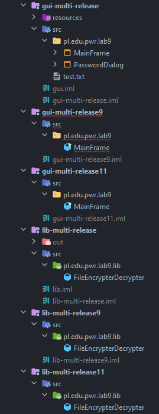
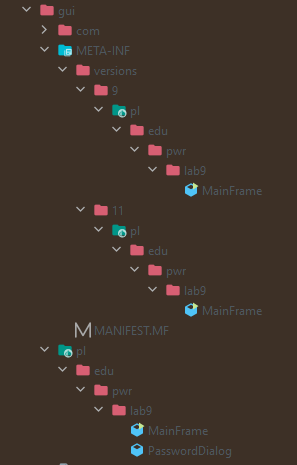

# Lab 10
## Wielowydaniowe jar'y, tworzenie instalatora

W ramach 10 laboratoriów z javy należało stworzyć plik *jar*, który byłby kompatybilny z wieloma wersjami javy.
Java natywnie wspiera tworzenie takich jarów, a oficjalna dokumentacja tej funkcjonalności znajduje sie pod [tym](https://openjdk.java.net/jeps/238) linkiem.
W drugiej części zajęć należało wygenerować instalator stworzonej aplikacji, który generowałby odpowiedni plik ueuchamialny w danym systemie operacyjnym.

### Wielowydaniowy jar
W celu stworzenia wielowydaniowego jar'a, stworzone zostały osobne projekty dla każdej wersji javy (11 oraz 9), a standardowa wersja projektu została zmieniona na jave 8.
Po wykonaniu tego kroku struktura plików w całym projekcie prezentowała się tak jak poniżej



Następnym krokiem było usunięcie wszelkich błędów, które wystąpiły po zmianie wersji bazowej danego projektu.
Aby ułatwić sobie debuggowanie każdego z projektów dodane zostały także println'y, mówiące z której wersji javy dana klasa pochodzi.

```java
System.out.println("In java 9");
```

Następnie należało odpowiednio skompilować każy z projektów. W tym celu dla każdego z nich została zdefinowana odpowiednia ścieżka na skompilowane pliki.
Projekty bazowe (gui-multi-release oraz lib-multi-release) zostały skompilowane do odpowiadających im folderów, natomiast projekty wersji do folderów ``<root>/META-INF/version/<version>``, gdzie root jest folderem projektu bazowego, a version wersją kompilowanego projektu. 
Poniżej znajduje sie przykładowa struktura skompilowanych plików na przykładzie dla gui


Ostanim krokiem pozostało stworzenie finalnych plików *.jar*:
Aby to zrobić należało najpierw stworzyć pliki *MANIFEST.MF*:

```
Manifest-Version: 1.0  
Main-Class: pl.edu.pwr.lab9.MainFrame  
Multi-Release: true
```

Teraz pozostało spakować wszystkie skomilowane pliki do pliku *.jar*.

### Tworzenie instalatora
Tworzenie instalatora jest bardzo proste dzięki narzędziu *jpackage* dostarczonemu deweloperom wraz z *jdk*. Aby wygenerować instalator natywny pod danym systemem operacyjnym użyta została komenda:
```bat
jpackage -i . -n FileEncryptor --main-class pl.edu.pwr.lab9.MainFrame --main-jar Multi-Release-Enc-Dec-Gui.jar
```
