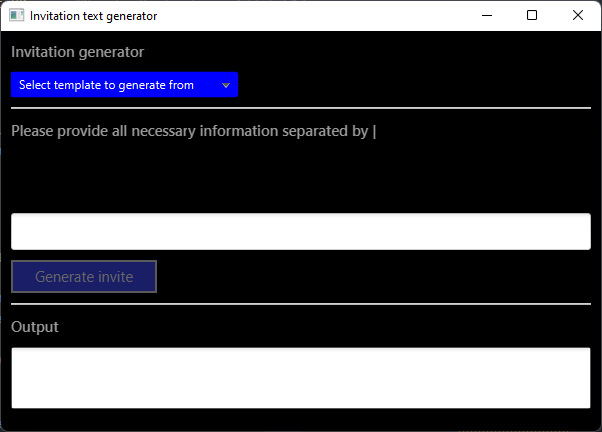
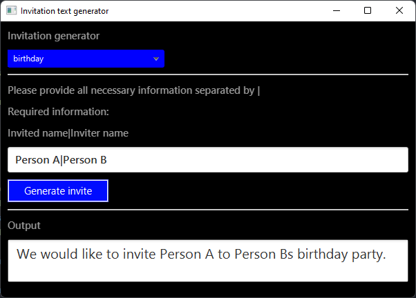

# Lab 13 - Raport

## Jak uruchonmić?
Program używa Gradle do generowania wszystkich odpowiednich plików oraz zaraządzania środowiskiem uruchomienonwym.

Aby uruchomić program:
```bat
./gradlew run
```
Powyższa komenda uruchomi Gradle daemon, który pobierze wszystkie wymagane zależności oraz uruchomi program.

**UWAGA: Program był rozwijany na JDK wersji 11 i takiej też wersji wymaga Gradle do odpowiedniego działania!**

Aby wygenerować plik .jar:
```bat
./gradlew jar
```

Program opiera się na ResourceBundle dostarczanych przez jave, a dokładniej zczytuje on zawartości odpowiedniego resourcebundle,
następnie iteruje po wszystkich kluczach przez niego oferowanych, filtruje szablony do zaproszeń, oraz listuje w ComboBox'ie.

Poniżej przedstawiony został program w stanie początkowym



